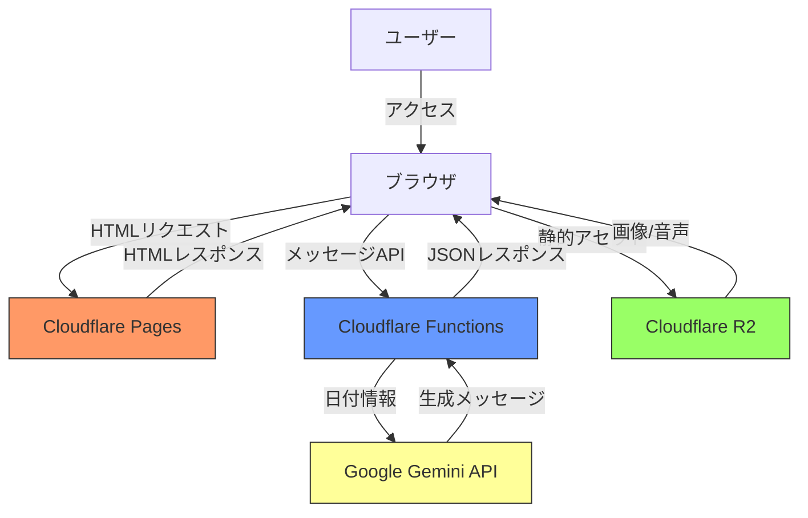
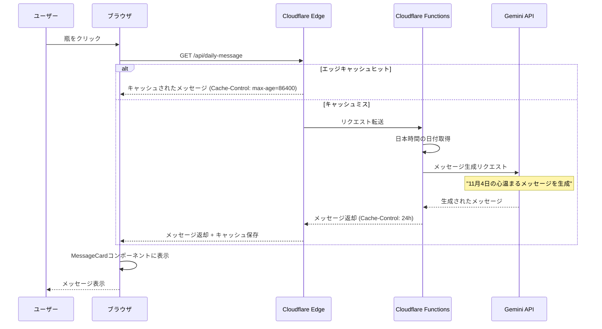
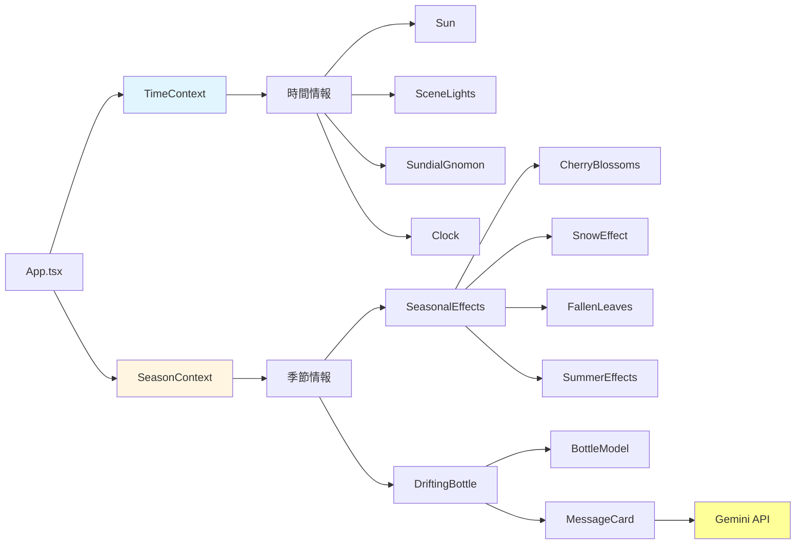

# Biotope プロジェクト

React、TypeScript、Three.jsを使用したビオトープ環境シミュレーションWebアプリケーション。

🌐 **Live Demo**: https://biotope.pages.dev/

## 主な機能

- **3Dビオトープ環境**: Three.js + React Three Fiberによる没入型3D環境
- **リアルタイム時計**: 日本時間（UTC+9）と連動した昼夜サイクル
- **動的照明**: 実時間に応じた太陽の位置と照明変化
- **季節エフェクト**:
  - **春**: 桜の花びら
  - **夏**: 陽炎エフェクト、強い日差し
  - **秋**: 紅葉の落ち葉（7色）
  - **冬**: 雪、冷たい照明
- **インタラクティブ要素**:
  - 水面アニメーション
  - 日時計（影の動き）
  - 漂流する瓶（クリックで季節×時間帯の便箋表示）
  - 風向きコンパス
- **AI生成メッセージ**: Google Gemini APIによる1日1回の日付関連メッセージ生成
- **レスポンシブデザイン**: PC/モバイル対応

## 技術スタック

- **フロントエンド**: React 19 + TypeScript
- **ビルドツール**: Vite 7
- **3D描画**: Three.js + @react-three/fiber + @react-three/drei
- **物理エンジン**: @react-three/rapier
- **AI**: Google Gemini 2.0 Flash (メッセージ生成)
- **デプロイ**: Cloudflare Pages
- **サーバーレス**: Cloudflare Functions
- **ストレージ**: Cloudflare R2

## セットアップ

1. リポジトリをクローン:
   ```bash
   git clone git@github.com:andsaki/biotope.git
   cd biotope-project
   ```

2. 依存関係をインストール:
   ```bash
   npm install
   ```

3. 開発サーバーを起動:
   ```bash
   npm run dev
   ```

4. ビルド:
   ```bash
   npm run build
   ```

## プロジェクト構造

```
src/
├── components/              # UIコンポーネント
│   ├── DriftingBottle/
│   │   ├── index.tsx            # 漂流瓶メインコンポーネント
│   │   ├── BottleModel.tsx      # 瓶の3Dモデル
│   │   └── MessageCard.tsx      # メッセージカード表示（AI生成対応）
│   ├── FishManager.tsx          # 魚の管理
│   ├── Ground.tsx               # 地面
│   ├── WaterSurface.tsx         # 水面
│   ├── SeasonalEffects.tsx      # 季節エフェクト統合
│   ├── Sun.tsx                  # 太陽
│   ├── SceneLights.tsx          # ライティング
│   ├── Clock.tsx                # リアルタイム時計表示
│   └── UI.tsx                   # メインUI
├── hooks/                   # カスタムフック
│   ├── useRealTime.ts           # 日本時間管理
│   ├── useWindDirection.ts      # 風向き管理
│   ├── useLoader.ts             # ローディング管理
│   └── useBottleAnimation.ts    # 瓶の漂流アニメーション
├── contexts/                # 状態管理
│   ├── SeasonContext.tsx        # 季節管理（リアルタイム判定対応）
│   └── TimeContext.tsx          # 時間情報共有
├── utils/                   # ユーティリティ関数
│   ├── sunPosition.ts           # 太陽位置計算
│   ├── time.ts                  # 時間帯判定
│   ├── random.ts                # ランダム選択
│   └── messageUtils.ts          # メッセージ取得ロジック
├── constants/               # 定数データ
│   └── bottleMessages.ts        # 季節×時間帯メッセージ集
├── constants.ts             # アプリケーション定数
└── assets/                  # 静的資産（R2アップロード対象）

functions/
└── api/
    └── daily-message.ts     # Cloudflare Functions - AI日次メッセージ生成API
```

## パフォーマンス最適化

### コード分割
`React.lazy` と `Suspense` で重い3Dコンポーネントを遅延読み込み。

### React.memo
主要コンポーネントをメモ化して不要な再レンダリングを防止。

### レンダリング効率化
- **FishManager**: refベースの時間管理で計算削減
- **ParticleLayer**: 更新頻度を50%削減（2フレームに1回）

### Viteビルド最適化
```ts
// vite.config.ts
export default defineConfig({
  build: {
    minify: 'esbuild',
    rollupOptions: {
      output: {
        manualChunks: {
          'react-vendor': ['react', 'react-dom'],
          'three-vendor': ['three', '@react-three/fiber', '@react-three/drei', '@react-three/rapier'],
        },
      },
    },
  },
});
```

## CI/CD

### GitHub Actions ワークフロー

1. **upload-to-r2.yml**: アセットをCloudflare R2に自動アップロード
   - アセット変更時のみ実行（paths指定）
   - npmキャッシュでWranglerインストール高速化
   - 並列アップロードで10ファイルを同時処理
   - Actions v4で高速化

2. **cache-warm.yml**: 毎日15:00 JSTにキャッシュウォーム

### デプロイ
Cloudflare Pagesに自動デプロイ。アセットはR2から配信。

## アーキテクチャ

### システム構成図



### メッセージ生成フロー



### レンダリングフロー



## AI機能の詳細

### Gemini API統合

`functions/api/daily-message.ts` でCloudflare Functionsを使用し、毎日日本時間の日付に応じた心温まるメッセージを生成。

**特徴**:
- **モデル**: Gemini 2.0 Flash (高速・低コスト)
- **プロンプト**: 200文字以内、季節感のある前向きなメッセージ
- **キャッシュ**: 1日キャッシュで無駄なAPI呼び出しを削減
- **フォールバック**: 生成失敗時は既存の季節×時間帯メッセージにフォールバック

**API仕様**:
```
GET /api/daily-message

Response:
{
  "date": "2025-11-04",
  "dateDescription": "11月4日（火曜日）",
  "message": "霜月の風に、心も新しく...",
  "generatedAt": "2025-11-04T15:00:00.000Z"
}
```

### 環境変数設定

Cloudflare Pagesの環境変数で設定:
```
GEMINI_API_KEY=your_api_key_here
```

## ドキュメント

- [`docs/drifting-bottle-feature.md`](docs/drifting-bottle-feature.md): 漂流する瓶の機能説明
- [`docs/realtime-clock-feature.md`](docs/realtime-clock-feature.md): リアルタイム時計の機能説明
- [`docs/seasonal-effects-feature.md`](docs/seasonal-effects-feature.md): 季節エフェクトの機能説明
- [`docs/refactoring-summary.md`](docs/refactoring-summary.md): リファクタリング概要

## ライセンス

MIT
