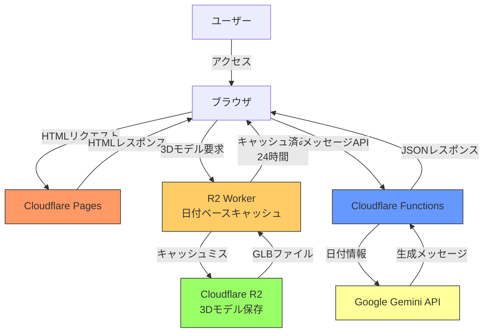
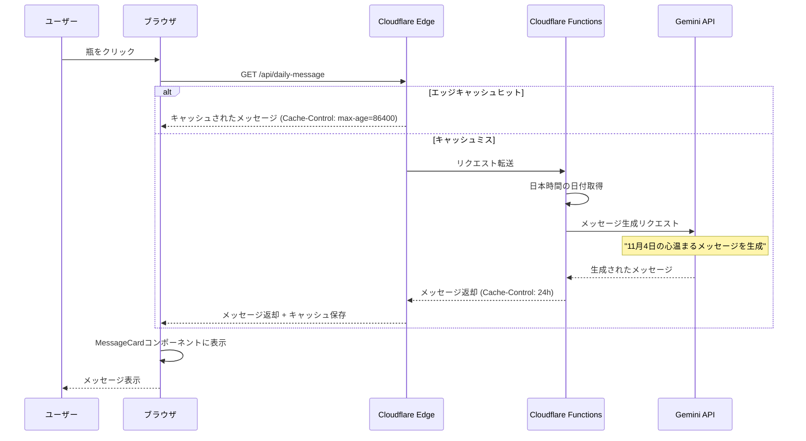
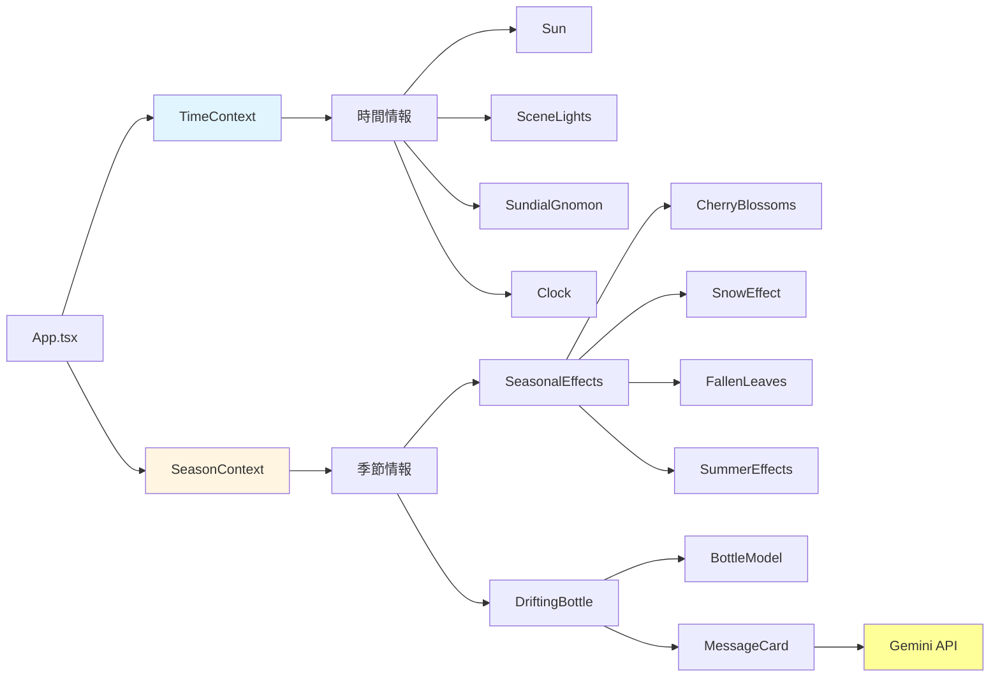

# Biotope プロジェクト

React、TypeScript、Three.jsを使用したビオトープ環境シミュレーションWebアプリケーション。

## 主な機能

- **3Dビオトープ環境**: Three.js + React Three Fiberによる没入型3D環境
- **リアルタイム時計**: 日本時間（UTC+9）と連動した昼夜サイクル
- **動的照明**: 実時間に応じた太陽の位置と照明変化
- **季節エフェクト**:
  - **春**: 桜の花びら（平面パーティクル）
  - **夏**: 陽炎エフェクト、強い日差し、**蓮の葉3Dモデル（波連動）**
  - **秋**: **3D落ち葉モデル（水面浮遊・リアルな動き）**
  - **冬**: 雪、冷たい照明
- **インタラクティブ要素**:
  - 水面アニメーション（波紋エフェクト）
  - 日時計（影の動き）
  - 漂流する瓶（クリックで季節×時間帯の便箋表示）
  - 風向きコンパス
- **3Dモデル統合**:
  - **魚**: カレイ（底生魚の動き：待機→瞬間移動）
  - **植物**: 蓮の葉（夏・波に連動）、水草
  - **自然要素**: 落ち葉（秋・水面浮遊）
- **AI生成メッセージ**: Google Gemini APIによる1日1回の日付関連メッセージ生成
- **レスポンシブデザイン**: PC/モバイル対応

## 技術スタック

- **フロントエンド**: React 19 + TypeScript
- **ビルドツール**: Vite 7
- **3D描画**: Three.js + @react-three/fiber + @react-three/drei
- **物理エンジン**: @react-three/rapier
- **デザインシステム**: トークンベースのスタイリング (tokens.ts)
- **AI**: Google Gemini 2.0 Flash (メッセージ生成)
- **デプロイ**: Cloudflare Pages
- **サーバーレス**: Cloudflare Functions
- **ストレージ**: Cloudflare R2（3Dモデル配信）
- **CDN**: Cloudflare Workers（R2キャッシュ）

Cloudflare 上での各サービスの役割とシーケンス図は `docs/cloudflare-services.md` を参照してください。

## セットアップ

1. リポジトリをクローン:
   ```bash
   git clone git@github.com:andsaki/biotope.git
   cd biotope-project
   ```

2. 依存関係をインストール:
   ```bash
   npm install
   ```

3. 開発サーバーを起動:
   ```bash
   npm run dev
   ```

4. ビルド:
   ```bash
   npm run build
   ```

## プロジェクト構造

```
src/
├── components/              # UIコンポーネント
│   ├── DriftingBottle/
│   │   ├── index.tsx            # 漂流瓶メインコンポーネント
│   │   ├── BottleModel.tsx      # 瓶の3Dモデル
│   │   └── MessageCard.tsx      # メッセージカード表示（AI生成対応）
│   ├── FishManager.tsx          # 魚の管理（カレイ3Dモデル含む）
│   ├── Ground.tsx               # 地面
│   ├── WaterSurface.tsx         # 水面（波紋アニメーション）
│   ├── WaterPlantsLarge.tsx     # 水草・蓮の葉（3Dモデル・波連動）
│   ├── FallenLeaves.tsx         # 秋の落ち葉（3Dモデル・水面浮遊）
│   ├── ParticleLayer.tsx        # 季節別パーティクル（形状最適化）
│   ├── SeasonalEffects.tsx      # 季節エフェクト統合
│   ├── Sun.tsx                  # 太陽
│   ├── SceneLights.tsx          # ライティング
│   ├── Clock.tsx                # リアルタイム時計表示
│   ├── WindDirectionDisplay.tsx # 風向きコンパス表示
│   └── UI.tsx                   # メインUI
├── hooks/                   # カスタムフック
│   ├── useRealTime.ts           # 日本時間管理
│   ├── useWindDirection.ts      # 風向き管理
│   ├── useLoader.ts             # ローディング管理
│   └── useBottleAnimation.ts    # 瓶の漂流アニメーション
├── contexts/                # 状態管理
│   ├── SeasonContext.tsx        # 季節管理（リアルタイム判定対応）
│   └── TimeContext.tsx          # 時間情報共有
├── styles/                  # デザインシステム
│   └── tokens.ts                # デザイントークン（色、影、サイズなど）
├── utils/                   # ユーティリティ関数
│   ├── sunPosition.ts           # 太陽位置計算
│   ├── time.ts                  # 時間帯判定
│   ├── random.ts                # ランダム選択
│   ├── messageUtils.ts          # メッセージ取得ロジック
│   └── dailyMessage.ts          # AI日次メッセージAPI呼び出し
├── constants/               # 定数ファイル（リファクタリング済み）
│   ├── bottleMessages.ts        # 季節×時間帯メッセージ集
│   ├── fish.ts                  # 魚の動作・表示定数
│   ├── fallenLeaves.ts          # 落ち葉エフェクト定数
│   ├── particle.ts              # パーティクルシステム定数
│   ├── cherryBlossoms.ts        # 桜エフェクト定数
│   ├── snowEffect.ts            # 雪エフェクト定数
│   ├── clouds.ts                # 雲の定数
│   ├── waterSurface.ts          # 水面の定数
│   ├── bubbleEffect.ts          # 泡エフェクト定数
│   ├── lighting.ts              # ライティング定数
│   ├── waterPlants.ts           # 水草・蓮の葉定数
│   ├── rocks.ts                 # 岩の配置定数
│   ├── stars.ts                 # 星空の定数
│   └── sundial.ts               # 日時計の定数
├── constants.ts             # アプリケーション定数
└── assets/                  # 静的資産（R2アップロード対象）
    ├── cc0____yellow_striped_flounder.glb       # カレイ3Dモデル
    ├── cc0__deep_autumn__5k_followers_milestone.glb  # 落ち葉3Dモデル
    └── cc0__water_lily_nymphaea_cv..glb         # 蓮の葉3Dモデル

functions/
└── api/
    └── daily-message.ts     # Cloudflare Functions - AI日次メッセージ生成API

r2-worker/
└── src/
    └── index.ts             # Cloudflare R2 Worker - 日付ベースキャッシュ
```

## デザインシステム

### トークンベース設計

プロジェクト全体で一貫したデザインを実現するため、`src/styles/tokens.ts` でデザイントークンを一元管理:

- **colors**: カラーパレット（paperBg、textPrimary、accentなど）
- **shadows**: 影スタイル（sm、md、lg、inset）
- **radius**: 角丸サイズ
- **spacing**: 余白サイズ
- **positioning**: PC/モバイル別の配置
- **componentSizes**: コンポーネントサイズ
- **typography**: フォント設定
- **transitions**: アニメーション速度
- **zIndex**: 重なり順

### 定数ファイルの設計原則

プロジェクト全体の保守性向上のため、**全てのマジックナンバーを定数化**:

#### 命名規則
- `UPPER_SNAKE_CASE`で統一
- 意味が明確な名前を使用（例: `FISH_BOUNDARY_X_MAX`）

#### ファイル構成
各コンポーネントの定数は独立したファイルに分離:
```typescript
// src/constants/fish.ts の例
export const NORMAL_FISH_COUNT = 10;
export const FISH_SPEED = {
  SPRING: 0.015,
  SUMMER: 0.02,
  AUTUMN: 0.01,
  WINTER: 0.005,
} as const;
```

#### メリット
1. **一箇所での調整**: パラメータ変更時に定数ファイルのみ編集
2. **可読性向上**: マジックナンバーが消え、意図が明確に
3. **型安全性**: `as const`で読み取り専用オブジェクトとして型推論
4. **再利用性**: 複数コンポーネントで同じ定数を共有可能

## パフォーマンス最適化

### 1. 全体方針
- `useThrottledFrame` でアニメーションを間引き、Three.js の `useFrame` 依存を減らす
- GLTF 読み込みを共通化し、clone やマテリアル共有でメモリと CPU を節約
- Context を細分化して値の揺り戻しを防ぎ、React の再レンダリング負荷を減らす

### 2. レンダリング最適化

**FishManager**: 再レンダリング完全削減
- 毎フレームの`setState`を削除し、refのみ更新
- 重複した`useFrame`を1つに統合
- CPU使用率約40-50%削減

**季節エフェクト**: React.memoでメモ化
- `CherryBlossoms`, `SummerEffects`, `FallenLeaves`, `SnowEffect`をメモ化
- 季節が変わらない限り再レンダリングしない
- CPU使用率約10-15%削減

**その他コンポーネント**: 計算のメモ化
- `App.tsx`: `backgroundColor`を`useMemo`でキャッシュ
- `ParticleLayerInstanced`: `speedYRange`をメモ化し、行列を`Float32Array`へ直接書き込むことで Object3D のアロケーションと `setMatrixAt` の呼び出しを削減
- `Clouds`: ジオメトリ・マテリアルをメモ化
- `LightingController`: 昼夜でディレクショナルライトのシャドウ解像度を動的に切り替え、夜間は 1024→512 へ落として GPU/CPU 負荷を削減
- `Clouds`: すべての雲を単一の`useFrame`でまとめて更新し、30fpsのスロットル付きヘルパーに移行。さらにジオメトリ/マテリアルを全インスタンスで共有し、描画コールとCPU負荷を削減
- `WaterSurface`: `useThrottledFrame` で 30fps 単位の更新に切り替え、120fps 環境でも頂点更新の CPU 負荷が暴発しないように調整
- `BubbleEffect` / `FallenLeaves`: `useThrottledFrame` で泡・落ち葉の更新を 30fps に間引き、`leavesRefs` などの再計算コストを削減
- `UI` / `SimulationClock`: requestAnimationFrame でリサイズイベントを間引く `useIsMobile` フックを導入し、リサイズ中の再レンダリング嵐を解消
- `SimulationClock`: デジタル表示を共通DOMにまとめ、PCではアナログ時計を追 加する構成に再編
- `CherryBlossoms` / `SnowEffect`: `useThrottledFrame` を共有利用し、パーティクルの頂点更新を 30fps に抑えて CPU スパイクを削減
- `ParticleLayerInstanced`: 疑似乱数生成器（Mulberry32）で初期化＆リセットの乱数を管理し、`Math.random` の大量呼び出しと GC を抑制

### 3. 3Dモデル最適化

**clone最適化**: 事前作成で毎フレームのアロケーション削減
- `FishManager`: 魚モデルを`useMemo`で事前clone（CPU 30-40%↓）
- `FallenLeaves`: 落ち葉モデルを事前clone
- `PottedPlant`: GLTF を1度だけ読み込み、clone済みインスタンスを共有

**モデルURLの共通化**:
- `getModelUrl` ヘルパーと `useModelScene` / `preloadModel` を追加し、R2/ローカル切り替えと GLTF 読み込みを一元管理。魚 / 落ち葉 / 蓮 / 鉢植えなどから直書きURLと重複 `useGLTF` 呼び出しを排除

### 4. 状態管理の分割

- `TimeContext` を昼夜判定 (`useDayPeriod`) と時計 (`useClockTime`) の2系統に分割し、`useTime` は両者の合成に限定
- 昼夜しか使わない `FishManager` / `LightingController` / `Stars` / `ReflectedStars` は `useDayPeriod` に切り替え、1秒ごとの時計更新で巨大な3Dサブツリーが再レンダリングされることを防止
- React のレンダー負荷を大幅に削減し、GPUアニメーション (`useFrame`) 中心のボトルネックに集中できるようになった
- `WaterPlantsLarge`: 蓮の葉モデルを事前clone

```
useRealTime
   ├─ isDay ──▶ DayPeriodContext ──▶ useDayPeriod (FishManager / Lights / Stars...)
   └─ realTime ─▶ RealTimeContext ─▶ useClockTime (SimulationClock / UI)
```

**preload**: 初期ロード時間短縮
- `useGLTF.preload`で魚と落ち葉を事前ロード
- 初回レンダリング時の待機時間を約20-30%削減

### 3. ジオメトリ・マテリアル最適化

**インスタンス化レンダリング**:
- `ParticleLayerInstanced`: InstancedMeshで描画コール数を数百→1コールへ削減（GPU 60-70%↓）

**共有リソース**:
- `sharedMaterials.ts`: シングルトンパターンでマテリアル共有
- `Rocks`: 同一ジオメトリを全メッシュで再利用

**テクスチャキャッシュ**:
- `CherryBlossoms/SnowEffect`: クロージャーでテクスチャを一度だけ生成

### 4. 頂点計算最適化

**WaterSurface**: フレームスキップと事前計算
- 頂点更新を2フレーム → 4フレームに1回に変更（50%削減）
- ネストループ内の重複`Math.sin`計算を外側に移動
- `MeshStandardMaterial`をメモ化
- CPU負荷約30-40%削減

**ReflectedStars**: フレームスキップ
- 反射星の頂点更新を2フレームに1回に削減（CPU 50%↓）

### 5. ref-ベースアニメーション

**BubbleEffect**: setState排除
- `useFrame`内での`setState`を削除し、refで直接position更新
- 不要な再レンダリングを完全に防止（CPU 40-50%↓）

### 6. Canvas設定とコード分割

**Canvas設定**:
```typescript
<Canvas
  gl={{
    powerPreference: "high-performance",
    alpha: false,
    stencil: false,
  }}
  dpr={[1, 2]}
  performance={{ min: 0.5 }}
/>
```

**コード分割**:
- `React.lazy`と`Suspense`で重い3Dコンポーネントを遅延読み込み

### 7. パフォーマンスモニター

開発時にFPS、描画コール数、メモリ使用量をリアルタイム表示
- `App.tsx`で`PERFORMANCE_MONITOR = true`に設定

### 期待効果

- **FPS**: 30-40 → 55-60 FPS
- **描画コール数**: 200-300 → 40-80コール
- **CPU使用率**: 約50-60%削減
- **メモリ使用量**: 約40-50%削減
- **フレームレート安定性**: 変動幅を約20-30%削減
- **初期ロード時間**: 約20-30%短縮

## 今後の検証タスク

1. 実機で昼夜を切り替えて、ディレクショナルライトのシャドウ解像度が意図通り 1024 ↔ 512 に変化するか、および描画品質への影響を確認する。
2. 必要に応じて `spotLight` など他ライトのシャドウ設定も同様にダウンサンプリングし、コストと見た目のバランスを再評価する。

### Viteビルド最適化

```ts
// vite.config.ts
export default defineConfig({
  build: {
    minify: 'esbuild',
    target: 'esnext',  // 最新のJavaScript機能を活用
    cssCodeSplit: true,  // CSSコード分割
    rollupOptions: {
      output: {
        manualChunks: {
          'react-vendor': ['react', 'react-dom'],
          'three-vendor': ['three', '@react-three/fiber', '@react-three/drei', '@react-three/rapier'],
        },
      },
    },
  },
  optimizeDeps: {
    include: ['react', 'react-dom', 'three', '@react-three/fiber', '@react-three/drei'],
    esbuildOptions: {
      target: 'esnext',  // 依存関係も最新ターゲット
    },
  },
  esbuild: {
    logOverride: { 'this-is-undefined-in-esm': 'silent' },
  },
});
```

## CI/CD

### GitHub Actions ワークフロー

1. **upload-to-r2.yml**: アセットをCloudflare R2に自動アップロード
   - アセット変更時のみ実行（paths指定）
   - npmキャッシュでWranglerインストール高速化
   - 並列アップロードで10ファイルを同時処理
   - Actions v4で高速化

2. **cache-warm.yml**: 毎日15:00 JSTにキャッシュウォーム

### デプロイ
Cloudflare Pagesに自動デプロイ。アセットはR2から配信。
Cloudflare 上の各サービスの役割と詳細なフローは `docs/cloudflare-services.md` を参照してください。

## アーキテクチャ

### システム構成図



### メッセージ生成フロー



### レンダリングフロー



## AI機能の詳細

### Gemini API統合

`functions/api/daily-message.ts` でCloudflare Functionsを使用し、毎日日本時間の日付に応じた心温まるメッセージを生成。
Cloudflare 上の各サービス構成やシーケンス図の詳細は `docs/cloudflare-services.md` を参照。

**特徴**:
- **モデル**: Gemini 2.0 Flash (高速・低コスト)
- **プロンプト**: 200文字以内、季節感のある前向きなメッセージ
- **生成設定**:
  - `temperature: 0.9` - 生成の創造性（0〜1、高いほど多様な表現）
  - `maxOutputTokens: 2000` - 生成されるメッセージの最大長
- **キャッシュ**: 1日キャッシュで無駄なAPI呼び出しを削減
- **フォールバック**: 生成失敗時は既存の季節×時間帯メッセージにフォールバック

**API仕様**:
```
GET /api/daily-message

Response:
{
  "date": "2025-11-04",
  "dateDescription": "11月4日（火曜日）",
  "message": "霜月の風に、心も新しく...",
  "generatedAt": "2025-11-04T15:00:00.000Z"
}
```

### 環境変数設定

Cloudflare Pagesの環境変数で設定:
```
GEMINI_API_KEY=your_api_key_here
```

## 3Dモデルの詳細

### カレイ（底生魚）

**ファイル**: `cc0____yellow_striped_flounder.glb`
**実装**: `FishManager.tsx`

- 地面（Y=-0.9）に密着して配置
- **動き**: 待機（10-20秒）→ 瞬間移動（0.3-0.5秒）→ 待機のサイクル
- 待機中は透明度を下げて砂に擬態（opacity: 0.6）
- 夜間はさらに暗く表示（opacity: 0.3）
- 3匹配置、サイズは1.5-2.0でランダム化

### 蓮の葉（夏限定）

**ファイル**: `cc0__water_lily_nymphaea_cv..glb`
**実装**: `WaterPlantsLarge.tsx`

- 水面付近（Y=7.9）に4枚配置
- **波連動**: WaterSurfaceコンポーネントと同じ波の計算式を使用
  ```typescript
  // 水面の高さ（WaterSurface.tsxと同じ）
  const waterHeight = 8 + Math.sin(time * 1.5) * 0.5;
  // 各葉の位置での波紋を考慮
  const localWave = Math.sin(data.position[0] * 0.3 + time * 2.5) *
                   Math.cos(data.position[2] * 0.3 + time * 2.5) * 0.05;
  ```
- 各葉の位置での局所的な波紋効果を追加
- 波の傾斜に合わせてX/Z軸で傾く自然な動き

### 落ち葉（秋限定）

**ファイル**: `cc0__deep_autumn__5k_followers_milestone.glb`
**実装**: `FallenLeaves.tsx`

- 水面（Y=8.05）に15枚浮遊
- **リアルな動き**:
  - 浮き沈み: 各葉が独自の速度と位相で上下に揺れる
  - 横移動: X/Z軸で異なる速度で円を描く
  - 回転: Y軸でゆっくり回転、X/Z軸でわずかに傾く
- 各葉が異なるタイミングで動き自然な表現を実現
- パフォーマンス最適化: `useMemo`で初期位置データを固定

## パーティクルシステムの改善

**実装**: `ParticleLayer.tsx`

季節ごとにパーティクルの形状を最適化（キューブから自然な形状へ）:

| 季節 | 形状 | ジオメトリ |
|------|------|-----------|
| 春 | 桜の花びら | planeGeometry（平たい形） |
| 夏 | 小さな球体 | sphereGeometry（種や小さな葉） |
| 秋 | 平たい長方形 | planeGeometry（落ち葉） |
| 冬 | 雪 | sphereGeometry |

## R2 Workerキャッシュシステム

**実装**: `r2-worker/src/index.ts`

Cloudflare Workers + Cache APIで3Dモデルを効率的に配信:

### 日付ベースキャッシュ
- 日付（YYYY-MM-DD）をキャッシュキーに含めて同じ日は同じコンテンツを返す
- Cloudflare Cache APIで初回アクセス時にR2から取得し、以降はキャッシュから配信
- 日が変わると自動的に新しいキャッシュキーで更新

### キャッシュフロー
```typescript
// キャッシュキー例: https://cache.biotope/assets/model.glb?date=2025-12-01
const today = new Date().toISOString().split('T')[0];
const cacheKey = new URL(`https://cache.biotope/${objectName}?date=${today}`, request.url);

// Cache APIでキャッシュ確認
let response = await cache.match(cacheKey);
if (!response) {
  // R2から取得してキャッシュに保存
  const object = await env.R2_BUCKET.get(objectName);
  response = new Response(object.body, { headers });
  await cache.put(cacheKey, response.clone());
}
```

### 型安全性
- すべての`as any`を削除
- R2Bucket、R2Object、cachesの適切な型定義を追加
- TypeScriptで完全に型安全な実装

### CORS対応
- すべてのリクエストに適切なCORSヘッダーを付与
- プリフライトリクエスト（OPTIONS）にも対応

## ドキュメント

- [`docs/ai-guide.md`](docs/ai-guide.md): AI開発ガイド（効果的な開発ワークフロー、プロンプト例）
- [`docs/drifting-bottle-feature.md`](docs/drifting-bottle-feature.md): 漂流する瓶の機能説明
- [`docs/realtime-clock-feature.md`](docs/realtime-clock-feature.md): リアルタイム時計の機能説明
- [`docs/seasonal-effects-feature.md`](docs/seasonal-effects-feature.md): 季節エフェクトの機能説明
- [`docs/cloudflare-services.md`](docs/cloudflare-services.md): Cloudflare Functions / R2 Worker の役割とフロー

## ライセンス

MIT
