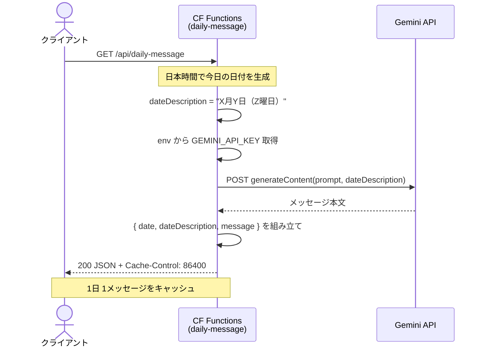
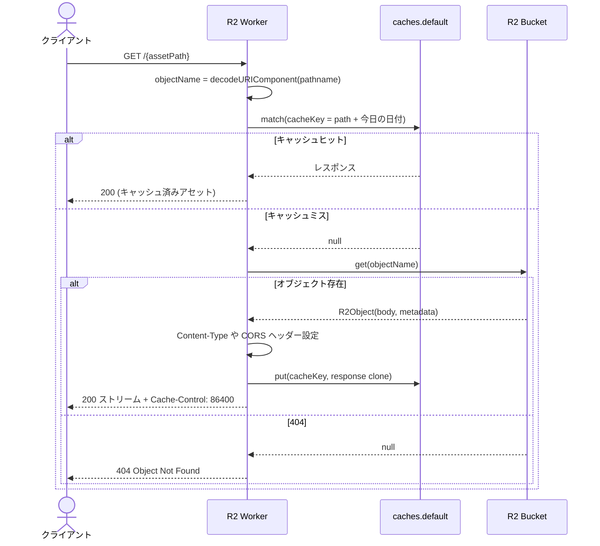

# Cloudflareサービス概要

Biotope Project では 2 つの Cloudflare サービスを運用しています。1 つは Gemini API を叩いて 1 日 1 回のメッセージを生成する Cloudflare Functions、もう 1 つは静的アセットを R2 から配信する Workers + R2 構成です。本稿ではそれぞれの役割とフローの違いをまとめます。

| 項目 | デイリーメッセージ API (`functions/api/daily-message.ts`) | R2 Worker (`r2-worker/src/index.ts`) |
| --- | --- | --- |
| 役割 | Gemini 2.0 Flash を呼び出し、日本時間に合わせた心温まるメッセージを JSON で返す | R2 バケットから 3D アセットなどの静的ファイルを取得しストリーミング配信 |
| エンドポイント | `GET /api/daily-message`（Cloudflare Functions on Pages） | `GET /{assetPath}`（Workers + R2） |
| データ形式 | JSON（`date`, `dateDescription`, `message`, `generatedAt`） | バイナリ/テキスト（Content-Type はオブジェクトの `httpMetadata` を反映） |
| 外部依存 | Gemini API (`GEMINI_API_KEY` が必要) | R2 Bucket のオブジェクト (`env.R2_BUCKET`) |
| キャッシュ戦略 | Edge キャッシュ + `Cache-Control: max-age=86400`（日付ごとに 1 回生成） | `caches.default` + `Cache-Control: max-age=86400`（同日中は R2 アクセスを省略） |
| CORS | `GET, OPTIONS` を許可、`Access-Control-Allow-Origin: *` | `GET, HEAD, OPTIONS` を許可、`Access-Control-Max-Age: 86400` |

## デイリーメッセージ API フロー

### 実装メモ

- `generateDailyMessage()` で prompt を組み立て、Gemini の `generateContent` を呼び出す。
- 日本時間は `toLocaleString({ timeZone: 'Asia/Tokyo' })` で算出し、`YYYY-MM-DD` をキャッシュキーに使う。
- 失敗時は 500 を返し、エラーメッセージをログに出力。

## R2 Worker アセット配信フロー

### 実装メモ

- `objectName` は URL パスから切り出し `decodeURIComponent` でデコード。
- `caches.default` のキーに日付を含めることで 1 日単位の再取得を保証。
- `env.R2_BUCKET.get()` が `null` を返した場合は 404 応答。
- すべてのレスポンスに CORS ヘッダーを付加し、プリフライト (`OPTIONS`) にも対応。
