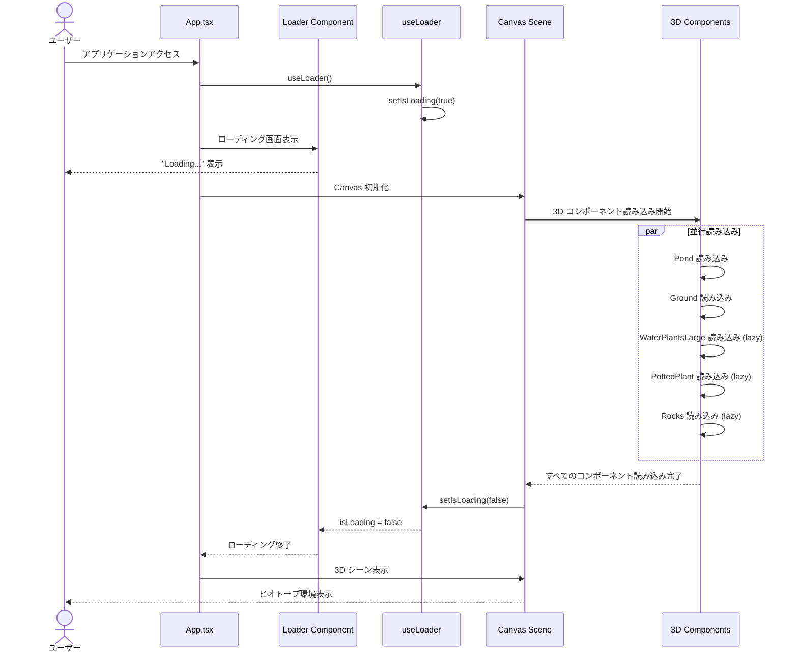
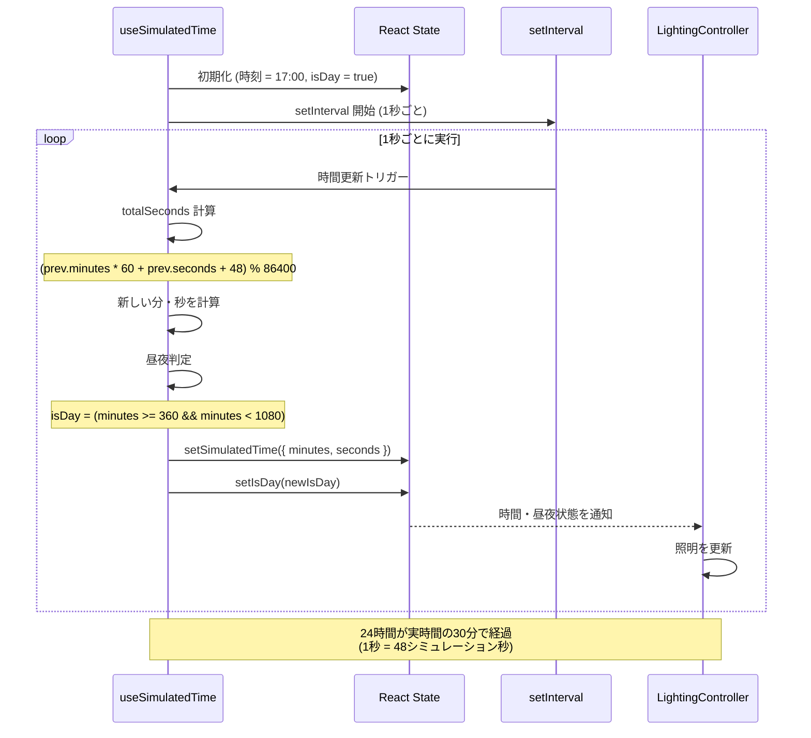
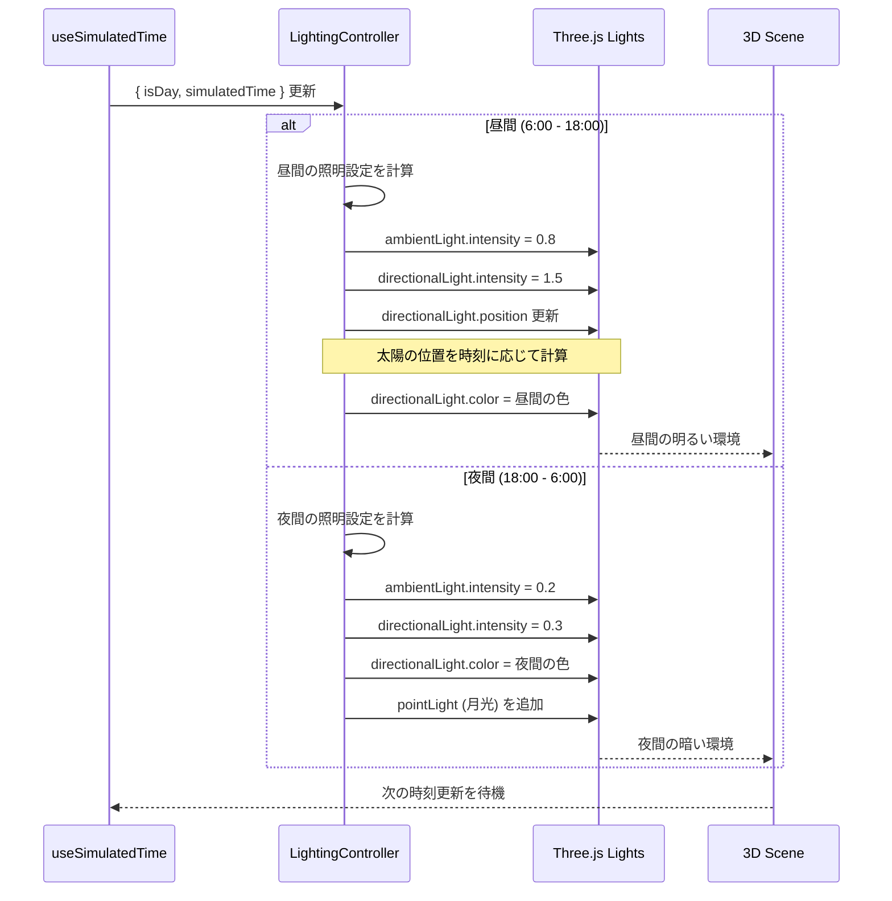
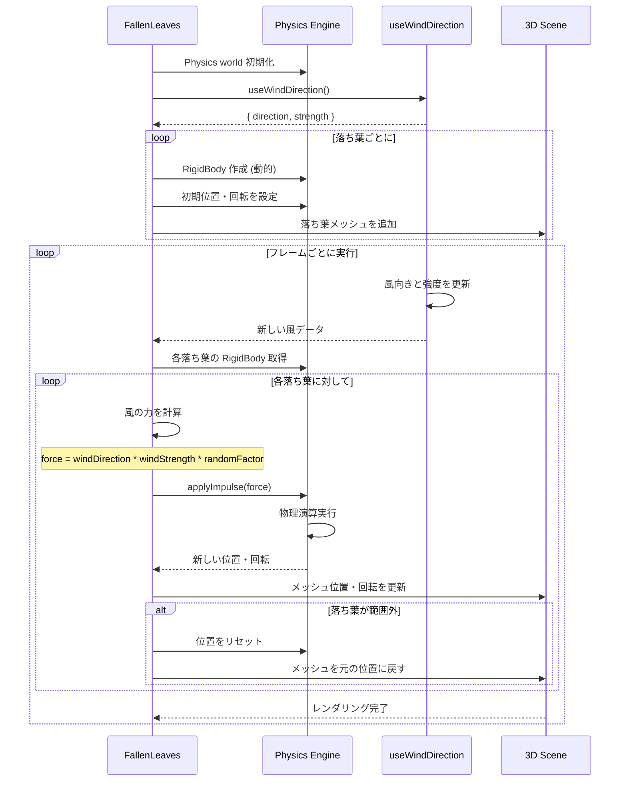
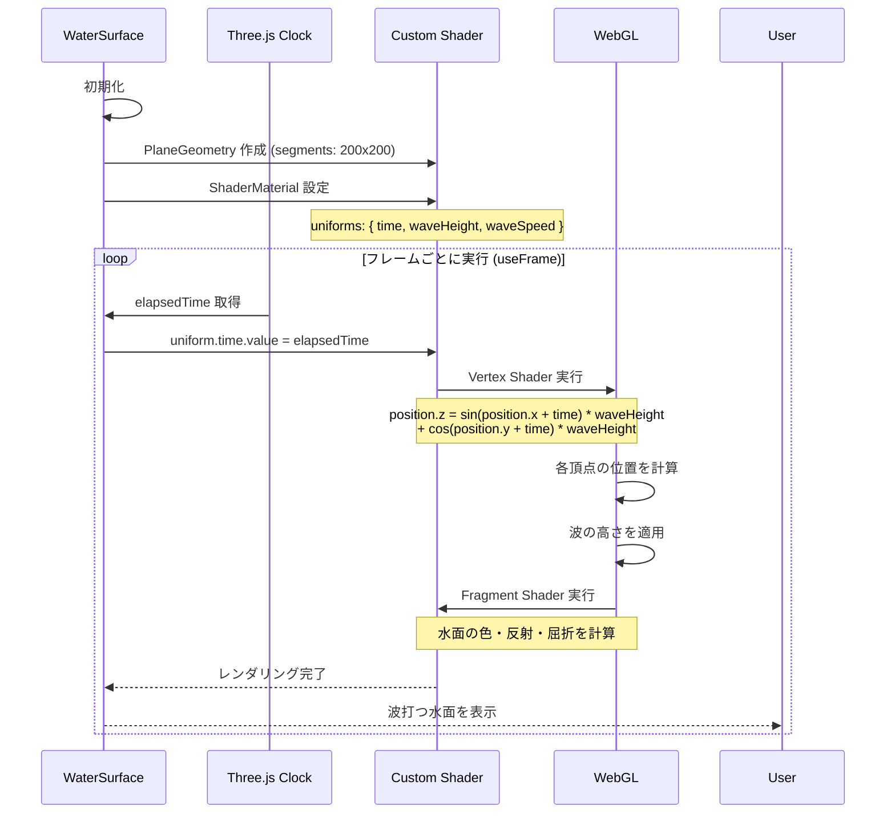
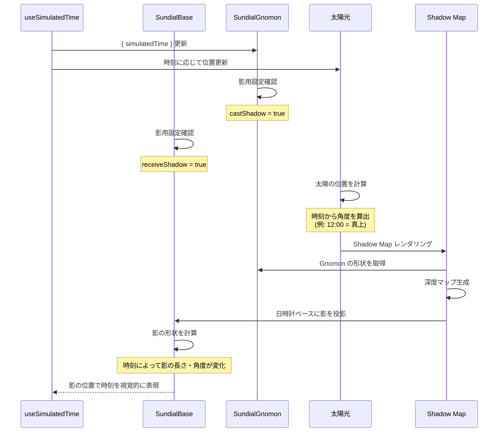
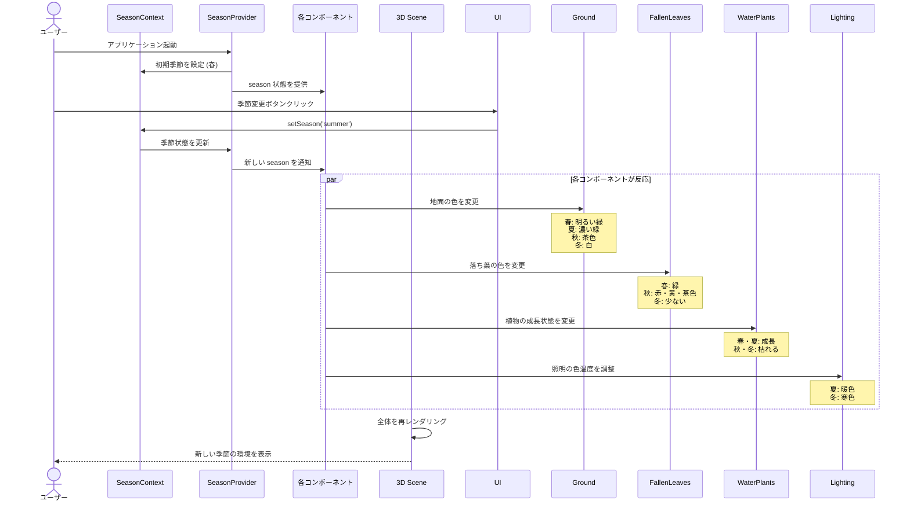
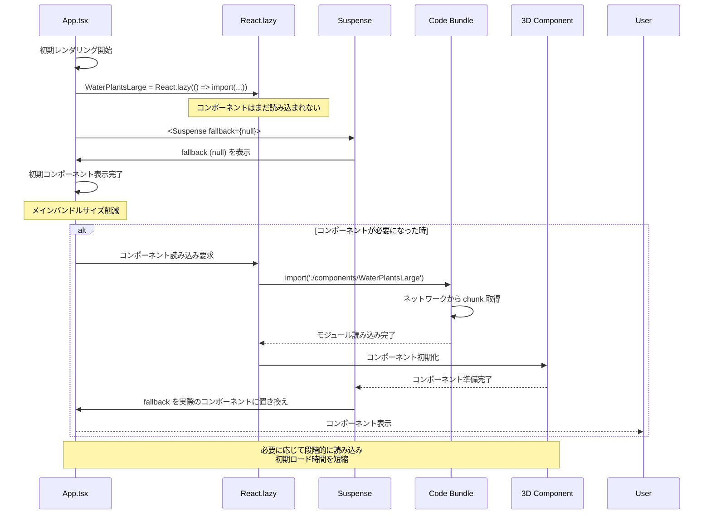

# シーケンス図

## 1. アプリケーション初期化フロー

```mermaid
sequenceDiagram
    actor User as ユーザー
    participant App as App.tsx
    participant Loader as Loader Component
    participant LoaderHook as useLoader
    participant Scene as Canvas Scene
    participant Components as 3D Components

    User->>App: アプリケーションアクセス
    App->>LoaderHook: useLoader()
    LoaderHook->>LoaderHook: setIsLoading(true)

    App->>Loader: ローディング画面表示
    Loader-->>User: "Loading..." 表示

    App->>Scene: Canvas 初期化
    Scene->>Components: 3D コンポーネント読み込み開始

    par 並行読み込み
        Components->>Components: Pond 読み込み
        Components->>Components: Ground 読み込み
        Components->>Components: WaterPlantsLarge 読み込み (lazy)
        Components->>Components: PottedPlant 読み込み (lazy)
        Components->>Components: Rocks 読み込み (lazy)
    end

    Components-->>Scene: すべてのコンポーネント読み込み完了
    Scene->>LoaderHook: setIsLoading(false)
    LoaderHook-->>Loader: isLoading = false
    Loader-->>App: ローディング終了
    App->>Scene: 3D シーン表示
    Scene-->>User: ビオトープ環境表示
```

## 2. 時間シミュレーションフロー

```mermaid
sequenceDiagram
    participant Hook as useSimulatedTime
    participant State as React State
    participant Interval as setInterval
    participant Components as LightingController

    Hook->>State: 初期化 (時刻 = 17:00, isDay = true)
    Hook->>Interval: setInterval 開始 (1秒ごと)

    loop 1秒ごとに実行
        Interval->>Hook: 時間更新トリガー
        Hook->>Hook: totalSeconds 計算
        Note over Hook: (prev.minutes * 60 + prev.seconds + 48) % 86400
        Hook->>Hook: 新しい分・秒を計算
        Hook->>Hook: 昼夜判定
        Note over Hook: isDay = (minutes >= 360 && minutes < 1080)
        Hook->>State: setSimulatedTime({ minutes, seconds })
        Hook->>State: setIsDay(newIsDay)
        State-->>Components: 時間・昼夜状態を通知
        Components->>Components: 照明を更新
    end

    Note over Hook,Components: 24時間が実時間の30分で経過<br/>(1秒 = 48シミュレーション秒)
```

## 3. 照明システム制御フロー

```mermaid
sequenceDiagram
    participant Time as useSimulatedTime
    participant Controller as LightingController
    participant Lights as Three.js Lights
    participant Scene as 3D Scene

    Time->>Controller: { isDay, simulatedTime } 更新

    alt 昼間 (6:00 - 18:00)
        Controller->>Controller: 昼間の照明設定を計算
        Controller->>Lights: ambientLight.intensity = 0.8
        Controller->>Lights: directionalLight.intensity = 1.5
        Controller->>Lights: directionalLight.position 更新
        Note over Controller,Lights: 太陽の位置を時刻に応じて計算
        Controller->>Lights: directionalLight.color = 昼間の色
        Lights-->>Scene: 昼間の明るい環境
    else 夜間 (18:00 - 6:00)
        Controller->>Controller: 夜間の照明設定を計算
        Controller->>Lights: ambientLight.intensity = 0.2
        Controller->>Lights: directionalLight.intensity = 0.3
        Controller->>Lights: directionalLight.color = 夜間の色
        Controller->>Lights: pointLight (月光) を追加
        Lights-->>Scene: 夜間の暗い環境
    end

    Scene-->>Time: 次の時刻更新を待機
```

## 4. 落ち葉物理シミュレーションフロー

```mermaid
sequenceDiagram
    participant Component as FallenLeaves
    participant Rapier as Physics Engine
    participant Wind as useWindDirection
    participant Scene as 3D Scene

    Component->>Rapier: Physics world 初期化
    Component->>Wind: useWindDirection()
    Wind-->>Component: { direction, strength }

    loop 落ち葉ごとに
        Component->>Rapier: RigidBody 作成 (動的)
        Component->>Rapier: 初期位置・回転を設定
        Component->>Scene: 落ち葉メッシュを追加
    end

    loop フレームごとに実行
        Wind->>Wind: 風向きと強度を更新
        Wind-->>Component: 新しい風データ

        Component->>Rapier: 各落ち葉の RigidBody 取得

        loop 各落ち葉に対して
            Component->>Component: 風の力を計算
            Note over Component: force = windDirection * windStrength * randomFactor
            Component->>Rapier: applyImpulse(force)
            Rapier->>Rapier: 物理演算実行
            Rapier-->>Component: 新しい位置・回転
            Component->>Scene: メッシュ位置・回転を更新

            alt 落ち葉が範囲外
                Component->>Rapier: 位置をリセット
                Component->>Scene: メッシュを元の位置に戻す
            end
        end

        Scene-->>Component: レンダリング完了
    end
```

## 5. 水面アニメーションフロー

```mermaid
sequenceDiagram
    participant Component as WaterSurface
    participant Clock as Three.js Clock
    participant Shader as Custom Shader
    participant GPU as WebGL

    Component->>Component: 初期化
    Component->>Shader: PlaneGeometry 作成 (segments: 200x200)
    Component->>Shader: ShaderMaterial 設定
    Note over Shader: uniforms: { time, waveHeight, waveSpeed }

    loop フレームごとに実行 (useFrame)
        Clock->>Component: elapsedTime 取得
        Component->>Shader: uniform.time.value = elapsedTime

        Shader->>GPU: Vertex Shader 実行
        Note over Shader,GPU: position.z = sin(position.x + time) * waveHeight<br/>+ cos(position.y + time) * waveHeight

        GPU->>GPU: 各頂点の位置を計算
        GPU->>GPU: 波の高さを適用

        GPU->>Shader: Fragment Shader 実行
        Note over GPU,Shader: 水面の色・反射・屈折を計算

        Shader-->>Component: レンダリング完了
        Component-->>User: 波打つ水面を表示
    end
```

## 6. 日時計の影計算フロー

```mermaid
sequenceDiagram
    participant Time as useSimulatedTime
    participant Base as SundialBase
    participant Gnomon as SundialGnomon
    participant DirectionalLight as 太陽光
    participant Shadow as Shadow Map

    Time->>Gnomon: { simulatedTime } 更新
    Time->>DirectionalLight: 時刻に応じて位置更新

    Gnomon->>Gnomon: 影用設定確認
    Note over Gnomon: castShadow = true

    Base->>Base: 影用設定確認
    Note over Base: receiveShadow = true

    DirectionalLight->>DirectionalLight: 太陽の位置を計算
    Note over DirectionalLight: 時刻から角度を算出<br/>(例: 12:00 = 真上)

    DirectionalLight->>Shadow: Shadow Map レンダリング
    Shadow->>Gnomon: Gnomon の形状を取得
    Shadow->>Shadow: 深度マップ生成
    Shadow->>Base: 日時計ベースに影を投影

    Base->>Base: 影の形状を計算
    Note over Base: 時刻によって影の長さ・角度が変化

    Base-->>Time: 影の位置で時刻を視覚的に表現
```

## 7. 季節の変化フロー

```mermaid
sequenceDiagram
    actor User as ユーザー
    participant Context as SeasonContext
    participant Provider as SeasonProvider
    participant Components as 各コンポーネント
    participant Scene as 3D Scene

    User->>Provider: アプリケーション起動
    Provider->>Context: 初期季節を設定 (春)
    Provider->>Components: season 状態を提供

    User->>UI: 季節変更ボタンクリック
    UI->>Context: setSeason('summer')
    Context->>Provider: 季節状態を更新
    Provider->>Components: 新しい season を通知

    par 各コンポーネントが反応
        Components->>Ground: 地面の色を変更
        Note over Ground: 春: 明るい緑<br/>夏: 濃い緑<br/>秋: 茶色<br/>冬: 白

        Components->>FallenLeaves: 落ち葉の色を変更
        Note over FallenLeaves: 春: 緑<br/>秋: 赤・黄・茶色<br/>冬: 少ない

        Components->>WaterPlants: 植物の成長状態を変更
        Note over WaterPlants: 春・夏: 成長<br/>秋・冬: 枯れる

        Components->>Lighting: 照明の色温度を調整
        Note over Lighting: 夏: 暖色<br/>冬: 寒色
    end

    Scene->>Scene: 全体を再レンダリング
    Scene-->>User: 新しい季節の環境を表示
```

## 8. パフォーマンス最適化: 遅延読み込みフロー

```mermaid
sequenceDiagram
    participant App as App.tsx
    participant Lazy as React.lazy
    participant Suspense as Suspense
    participant Bundle as Code Bundle
    participant Component as 3D Component

    App->>App: 初期レンダリング開始
    App->>Lazy: WaterPlantsLarge = React.lazy(() => import(...))
    Note over Lazy: コンポーネントはまだ読み込まれない

    App->>Suspense: <Suspense fallback={null}>
    Suspense->>App: fallback (null) を表示

    App->>App: 初期コンポーネント表示完了
    Note over App: メインバンドルサイズ削減

    alt コンポーネントが必要になった時
        App->>Lazy: コンポーネント読み込み要求
        Lazy->>Bundle: import('./components/WaterPlantsLarge')
        Bundle->>Bundle: ネットワークから chunk 取得
        Bundle-->>Lazy: モジュール読み込み完了
        Lazy->>Component: コンポーネント初期化
        Component-->>Suspense: コンポーネント準備完了
        Suspense->>App: fallback を実際のコンポーネントに置き換え
        App-->>User: コンポーネント表示
    end

    Note over App,Component: 必要に応じて段階的に読み込み<br/>初期ロード時間を短縮
```
